# 📮 Queue System & Background Jobs

**How Synapse handles heavy tasks in the background**

---

## 📋 Table of Contents

1. [Why Use Queues?](#why-use-queues)
2. [Queue Architecture](#queue-architecture)
3. [Available Queues](#available-queues)
4. [Job Processors](#job-processors)
5. [Adding Jobs](#adding-jobs)
6. [Creating New Job Types](#creating-new-job-types)
7. [Monitoring & Debugging](#monitoring--debugging)
8. [Best Practices](#best-practices)

---

## Why Use Queues?

### The Problem (Without Queues)

```typescript
// ❌ BAD: Blocks API response
export async function POST(req: NextRequest) {
  const message = await createMessage(data);
  
  // Send push notification (takes 1-2 seconds) 😱
  await sendPushNotification(userId, message);
  
  // Response delayed by 1-2 seconds!
  return NextResponse.json({ message });
}
```

**Problems:**
- 😱 Slow API response (2+ seconds)
- 😱 User waits for background task
- 😱 No retry on failure
- 😱 Server resources blocked

---

### The Solution (With Queues)

```typescript
// ✅ GOOD: Fast response, background processing
export async function POST(req: NextRequest) {
  const message = await createMessage(data);
  
  // Queue push notification (takes ~5ms) ⚡
  await queueService.addPushNotification({
    userId,
    payload: { title: 'New Message', body: message.content },
  });
  
  // Instant response!
  return NextResponse.json({ message });
}
```

**Benefits:**
- ⚡ Fast API response (~50ms)
- ⚡ Background worker processes job
- ⚡ Automatic retry on failure
- ⚡ Rate limiting built-in
- ⚡ Job history & monitoring

---

## Queue Architecture

### Components

```mermaid
graph TB
    subgraph NextJS["Next.js Application"]
        API["API Routes / Services<br/><br/>queueService.addPushNotification()<br/>queueService.addImageProcessing()<br/>queueService.addVideoProcessing()"]
        QService["QueueService<br/>(lib/queue/queue-service.ts)<br/><br/>• Manages queue operations<br/>• Type-safe job addition<br/>• Handles retries & failures"]
        API -->|Add job - fast, non-blocking| QService
    end
    
    subgraph Redis["Redis (Job Storage)"]
        PushQueue["Push Notification Queue<br/><br/>Job 1 (pending)<br/>Job 2 (pending)<br/>Job 3 (active)"]
        FileQueue["File Processing Queue<br/><br/>Job 1 (active)<br/>Job 2 (pending)<br/>Job 3 (failed)"]
    end
    
    subgraph Worker["BullMQ Worker (backend/worker.ts)"]
        PushWorker["Push Notification Worker<br/><br/>• Polls push-notifications queue<br/>• 5 jobs concurrently<br/>• Rate: 100 jobs/second<br/>• Auto-retry: 3 attempts"]
        FileWorker["File Processing Worker<br/><br/>• Polls file-processing queue<br/>• 3 jobs concurrently<br/>• Rate: 50 jobs/second"]
    end
    
    QService --> Redis
    PushQueue -->|Worker polls for jobs| PushWorker
    FileQueue -->|Worker polls for jobs| FileWorker
    
    style NextJS fill:#e1f5ff
    style Redis fill:#fff4e1
    style Worker fill:#e8f5e9
```



---

## Technology: BullMQ

**Why BullMQ?**
- ✅ Built on Redis (already in stack)
- ✅ TypeScript support
- ✅ Automatic retries with backoff
- ✅ Rate limiting built-in
- ✅ Job scheduling (delayed jobs)
- ✅ Job priorities
- ✅ Progress tracking
- ✅ Events for monitoring

---

## Available Queues

### 1. Push Notifications Queue

**Purpose:** Send push notifications to users

**Location:** `lib/queue/queues.ts`

**Configuration:**
```typescript
export const pushNotificationQueue = new Queue(QUEUE_NAMES.PUSH_NOTIFICATIONS, {
  connection: redisConnection,
  defaultJobOptions: {
    attempts: 3,              // Retry up to 3 times
    backoff: {
      type: 'exponential',
      delay: 2000,            // Start with 2s delay
    },
    removeOnComplete: {
      age: 24 * 3600,         // Keep completed jobs for 24 hours
      count: 1000,            // Keep last 1000 completed jobs
    },
    removeOnFail: {
      age: 7 * 24 * 3600,     // Keep failed jobs for 7 days
    },
  },
});
```

**Job Types:**
- `PUSH_NOTIFICATION` - Send web push notification

---

### 2. File Processing Queue

**Purpose:** Process images, videos, avatars

**Location:** `lib/queue/queues.ts`

**Configuration:**
```typescript
export const fileProcessingQueue = new Queue(QUEUE_NAMES.FILE_PROCESSING, {
  connection: redisConnection,
  defaultJobOptions: {
    attempts: 2,              // Retry up to 2 times (expensive!)
    backoff: {
      type: 'exponential',
      delay: 5000,            // Start with 5s delay
    },
    removeOnComplete: {
      age: 7 * 24 * 3600,     // Keep completed jobs for 7 days
      count: 500,             // Keep last 500 completed jobs
    },
    removeOnFail: {
      age: 7 * 24 * 3600,     // Keep failed jobs for 7 days
    },
  },
});
```

**Job Types:**
- `PROCESS_IMAGE` - Compress & optimize image
- `PROCESS_VIDEO` - Compress & optimize video
- `OPTIMIZE_AVATAR` - Generate multiple avatar sizes

---

## Job Processors

### Push Notification Processor

**Location:** `lib/queue/job-processors.ts`

```typescript
export async function processPushNotification(job: Job) {
  const { userId, payload } = job.data as {
    userId: string;
    payload: {
      title: string;
      body: string;
      url?: string;
      icon?: string;
    };
  };

  logger.log(`📤 Processing push notification job ${job.id} for user ${userId}`);

  try {
    // 1. Get all subscriptions for the user
    const subscriptions = await prisma.pushSubscription.findMany({
      where: { userId },
    });

    if (subscriptions.length === 0) {
      logger.log(`No subscriptions found for user ${userId}`);
      return { sent: 0, total: 0 };
    }

    const notificationPayload = JSON.stringify(payload);
    let sent = 0;
    let failed = 0;

    // 2. Send to all subscriptions
    await Promise.all(
      subscriptions.map(async (sub) => {
        try {
          await webpush.sendNotification(
            {
              endpoint: sub.endpoint,
              keys: {
                p256dh: sub.p256dh,
                auth: sub.auth,
              },
            },
            notificationPayload
          );
          sent++;
        } catch (error: unknown) {
          // If subscription is invalid (410 Gone), delete it
          const webPushError = error as { statusCode?: number };
          if (webPushError.statusCode === 410) {
            await prisma.pushSubscription.delete({
              where: { id: sub.id },
            });
            logger.log(`Removed invalid subscription ${sub.id}`);
          } else {
            logger.error(`Error sending push notification to ${sub.id}:`, error);
          }
          failed++;
        }
      })
    );

    logger.log(`✅ Push notification job ${job.id} completed: ${sent} sent, ${failed} failed`);
    return { sent, failed, total: subscriptions.length };
  } catch (error: unknown) {
    logger.error(`Error processing push notification job ${job.id}:`, error);
    throw error; // Triggers retry
  }
}
```

---

### Image Processing Processor

**Location:** `lib/queue/job-processors.ts`

```typescript
export async function processImage(job: Job) {
  const { fileId, filePath, userId } = job.data as {
    fileId: string;
    filePath: string;
    userId: string;
  };

  logger.log(`🖼️ Processing image job ${job.id} for file ${fileId}`);

  try {
    // 1. Read image from storage
    const buffer = await readFileFromStorage(filePath);

    // 2. Compress image
    const compressedBuffer = await sharp(buffer)
      .resize(1920, 1080, { fit: 'inside', withoutEnlargement: true })
      .jpeg({ quality: 85 })
      .toBuffer();

    // 3. Generate thumbnail
    const thumbnailBuffer = await sharp(buffer)
      .resize(320, 240, { fit: 'cover' })
      .jpeg({ quality: 75 })
      .toBuffer();

    // 4. Upload processed images
    const [compressedUrl, thumbnailUrl] = await Promise.all([
      uploadToStorage(compressedBuffer, `${fileId}-compressed.jpg`),
      uploadToStorage(thumbnailBuffer, `${fileId}-thumbnail.jpg`),
    ]);

    // 5. Update database
    await prisma.file.update({
      where: { id: fileId },
      data: {
        compressedUrl,
        thumbnailUrl,
        processed: true,
      },
    });

    logger.log(`✅ Image processing job ${job.id} completed`);
    return { compressedUrl, thumbnailUrl };
  } catch (error) {
    logger.error(`Error processing image job ${job.id}:`, error);
    throw error; // Triggers retry
  }
}
```

---

## Adding Jobs

### Using QueueService

**Location:** `lib/queue/queue-service.ts`

```typescript
export class QueueService {
  constructor(private logger: ILogger) {}

  /**
   * Add a push notification job
   */
  async addPushNotification(data: {
    userId: string;
    payload: {
      title: string;
      body: string;
      url?: string;
      icon?: string;
    };
  }): Promise<Job> {
    try {
      const job = await pushNotificationQueue.add(
        JOB_TYPES.PUSH_NOTIFICATION,
        data,
        {
          // Optional: Override default options
          priority: 1, // Higher = processed first
          delay: 0,    // Delay in ms (0 = immediate)
        }
      );

      this.logger.log(`✅ Push notification job added: ${job.id}`, {
        component: 'QueueService',
        userId: data.userId,
      });

      return job;
    } catch (error) {
      this.logger.error('Failed to add push notification job:', error, {
        component: 'QueueService',
        userId: data.userId,
      });
      throw error;
    }
  }

  /**
   * Add an image processing job
   */
  async addImageProcessing(data: {
    fileId: string;
    filePath: string;
    userId: string;
  }): Promise<Job> {
    try {
      const job = await fileProcessingQueue.add(
        JOB_TYPES.PROCESS_IMAGE,
        data
      );

      this.logger.log(`✅ Image processing job added: ${job.id}`, {
        component: 'QueueService',
        fileId: data.fileId,
      });

      return job;
    } catch (error) {
      this.logger.error('Failed to add image processing job:', error, {
        component: 'QueueService',
        fileId: data.fileId,
      });
      throw error;
    }
  }
}
```

---

### In API Routes

```typescript
// app/api/messages/route.ts
import { getService } from '@/lib/di';
import type { MessageService } from '@/lib/services/message.service';

export async function POST(req: NextRequest) {
  const messageService = await getService<MessageService>('messageService');
  
  const data = await req.json();
  
  // Create message (fast)
  const message = await messageService.createMessage(data);
  
  // MessageService internally queues push notifications via QueueService
  // No need to manually queue here!
  
  return NextResponse.json({ message });
}
```

**MessageNotificationService automatically queues:**

```typescript
// lib/services/message-notification.service.ts
export class MessageNotificationService {
  constructor(
    private roomRepo: RoomRepository,
    private queueService: QueueService,
    private logger: ILogger,
    private pushService: PushService
  ) {}

  async sendPushNotifications(
    roomId: string,
    senderId: string,
    content: string,
    type: string
  ): Promise<void> {
    const room = await this.roomRepo.findByIdWithRelations(roomId);
    if (!room) return;

    const recipients = room.members
      .filter(m => m.userId !== senderId)
      .map(m => m.userId);

    // Queue push notification for each recipient
    await Promise.all(
      recipients.map(userId =>
        this.queueService.addPushNotification({
          userId,
          payload: {
            title: `New message in ${room.name}`,
            body: content,
            url: `/chat/${roomId}`,
          },
        })
      )
    );
  }
}
```

---

## Creating New Job Types

### Step 1: Define Job Type

**Location:** `lib/queue/queues.ts`

```typescript
// Add new job type
export const JOB_TYPES = {
  PUSH_NOTIFICATION: 'push-notification',
  PROCESS_IMAGE: 'process-image',
  PROCESS_VIDEO: 'process-video',
  OPTIMIZE_AVATAR: 'optimize-avatar',
  SEND_EMAIL: 'send-email', // ✅ New job type
} as const;
```

---

### Step 2: Create Queue (if needed)

```typescript
// If using existing queue (e.g., pushNotificationQueue), skip this step
// Otherwise, create a new queue:

export const emailQueue = new Queue('email', {
  connection: redisConnection,
  defaultJobOptions: {
    attempts: 3,
    backoff: {
      type: 'exponential',
      delay: 2000,
    },
  },
});
```

---

### Step 3: Create Job Processor

**Location:** `lib/queue/job-processors.ts`

```typescript
export async function processSendEmail(job: Job) {
  const { to, subject, body } = job.data as {
    to: string;
    subject: string;
    body: string;
  };

  logger.log(`📧 Processing email job ${job.id} to ${to}`);

  try {
    // Send email using your email service
    await nodemailer.sendMail({
      from: process.env.EMAIL_FROM,
      to,
      subject,
      html: body,
    });

    logger.log(`✅ Email job ${job.id} completed`);
    return { success: true };
  } catch (error) {
    logger.error(`Error processing email job ${job.id}:`, error);
    throw error; // Triggers retry
  }
}
```

---

### Step 4: Register Worker

**Location:** `backend/worker.ts`

```typescript
// Create worker for email queue
const emailWorker = new Worker(
  'email', // Queue name
  async (job) => {
    logger.log(`🔄 Worker: Processing job ${job.id} of type ${job.name}`);
    
    switch (job.name) {
      case JOB_TYPES.SEND_EMAIL:
        return await processSendEmail(job);
      default:
        throw new Error(`Unknown job type: ${job.name}`);
    }
  },
  {
    connection: redisConnection,
    concurrency: 5, // Process 5 emails concurrently
    limiter: {
      max: 100, // Max 100 jobs
      duration: 1000, // Per second
    },
  }
);

// Worker event handlers
emailWorker.on('completed', (job) => {
  logger.log(`✅ Job ${job.id} completed`);
});

emailWorker.on('failed', (job, err) => {
  logger.error(`❌ Job ${job?.id} failed:`, err);
});
```

---

### Step 5: Add to QueueService

**Location:** `lib/queue/queue-service.ts`

```typescript
export class QueueService {
  // ... existing methods ...

  /**
   * Add an email job
   */
  async addEmail(data: {
    to: string;
    subject: string;
    body: string;
  }): Promise<Job> {
    try {
      const job = await emailQueue.add(JOB_TYPES.SEND_EMAIL, data);

      this.logger.log(`✅ Email job added: ${job.id}`, {
        component: 'QueueService',
        to: data.to,
      });

      return job;
    } catch (error) {
      this.logger.error('Failed to add email job:', error, {
        component: 'QueueService',
        to: data.to,
      });
      throw error;
    }
  }
}
```

---

### Step 6: Use in Services

```typescript
// lib/services/user.service.ts
export class UserService {
  constructor(
    private userRepo: UserRepository,
    private queueService: QueueService,
    private logger: ILogger
  ) {}

  async sendWelcomeEmail(userId: string): Promise<void> {
    const user = await this.userRepo.findById(userId);
    if (!user) return;

    // Queue welcome email
    await this.queueService.addEmail({
      to: user.email,
      subject: 'Welcome to Synapse!',
      body: `<h1>Welcome ${user.name}!</h1><p>Thanks for joining Synapse.</p>`,
    });

    this.logger.log(`Welcome email queued for user ${userId}`);
  }
}
```

---

## Monitoring & Debugging

### Worker Logs

**Start worker:**
```bash
npm run worker
```

**Output:**
```
🔄 Worker: Processing job 123 of type push-notification
📤 Processing push notification job 123 for user user_456
✅ Push notification job 123 completed: 2 sent, 0 failed
✅ Job 123 completed
```

---

### Job Status Tracking

```typescript
// Check job status
const job = await queueService.addPushNotification({ ... });

// Get job state
const state = await job.getState(); // 'active' | 'completed' | 'failed' | 'delayed'

// Get job progress
const progress = await job.progress; // 0-100

// Wait for job completion
const result = await job.waitUntilFinished();
```

---

### Queue Stats

```typescript
// Get queue stats
const counts = await pushNotificationQueue.getJobCounts();
// { active: 5, completed: 1000, failed: 3, delayed: 0, waiting: 10 }

// Get failed jobs
const failedJobs = await pushNotificationQueue.getFailed();

// Retry failed job
const job = await pushNotificationQueue.getJob(jobId);
await job.retry();
```

---

### BullBoard (Web UI)

**Install:**
```bash
npm install @bull-board/api @bull-board/express
```

**Setup:**
```typescript
// Optional: Add to backend/server.js for monitoring
import { createBullBoard } from '@bull-board/api';
import { BullMQAdapter } from '@bull-board/api/bullMQAdapter';
import { ExpressAdapter } from '@bull-board/express';

const serverAdapter = new ExpressAdapter();
createBullBoard({
  queues: [
    new BullMQAdapter(pushNotificationQueue),
    new BullMQAdapter(fileProcessingQueue),
  ],
  serverAdapter,
});

serverAdapter.setBasePath('/admin/queues');
app.use('/admin/queues', serverAdapter.getRouter());

// Access at: http://localhost:3001/admin/queues
```

---

## Best Practices

### ✅ DO

1. **Always use QueueService**
   ```typescript
   const queueService = await getService('queueService');
   await queueService.addPushNotification({ ... });
   ```

2. **Make job processors idempotent**
   ```typescript
   // ✅ Can be run multiple times safely
   export async function processNotification(job: Job) {
     // Check if already processed
     const existing = await checkIfProcessed(job.data.id);
     if (existing) return;
     
     // Process...
   }
   ```

3. **Handle failures gracefully**
   ```typescript
   export async function processJob(job: Job) {
     try {
       // Process job...
       return { success: true };
     } catch (error) {
       logger.error(`Job ${job.id} failed:`, error);
       throw error; // Triggers retry
     }
   }
   ```

4. **Use appropriate retry limits**
   ```typescript
   // Expensive operations: fewer retries
   await fileProcessingQueue.add(data, { attempts: 2 });
   
   // Cheap operations: more retries
   await pushNotificationQueue.add(data, { attempts: 3 });
   ```

5. **Clean up old jobs**
   ```typescript
   // Remove completed jobs after 24 hours
   removeOnComplete: {
     age: 24 * 3600,
     count: 1000,
   },
   ```

### ❌ DON'T

1. **Don't wait for job completion in API routes**
   ```typescript
   // ❌ BAD: Blocks response
   const job = await queueService.addPushNotification({ ... });
   await job.waitUntilFinished(); // Blocks!
   
   // ✅ GOOD: Fire and forget
   await queueService.addPushNotification({ ... });
   return NextResponse.json({ success: true });
   ```

2. **Don't queue jobs in loops unnecessarily**
   ```typescript
   // ❌ BAD: Creates too many jobs
   for (const user of users) {
     await queueService.addPushNotification({ userId: user.id, ... });
   }
   
   // ✅ GOOD: Batch job
   await queueService.addBatchPushNotification({
     users: users.map(u => u.id),
     payload: { ... },
   });
   ```

3. **Don't store large data in jobs**
   ```typescript
   // ❌ BAD: Large buffer in job data
   await queueService.addImageProcessing({
     fileBuffer: largeBuffer, // ❌ Too big for Redis!
   });
   
   // ✅ GOOD: Store file path
   await queueService.addImageProcessing({
     filePath: '/uploads/image.jpg', // ✅ Worker fetches from storage
   });
   ```

---

## Summary

**Key Takeaways:**

1. ✅ Queues make API responses fast (offload heavy tasks)
2. ✅ BullMQ provides automatic retries & rate limiting
3. ✅ Workers run in separate process (`npm run worker`)
4. ✅ All jobs stored in Redis
5. ✅ Use QueueService for type-safe job addition
6. ✅ Make processors idempotent (safe to retry)

**Next Steps:**

- Read [05-NOTIFICATION-SYSTEM.md](./05-NOTIFICATION-SYSTEM.md) to see queues in action
- Try creating a custom job type
- Monitor jobs with BullBoard

---

**Need Help?** Check `lib/queue/` for all queue-related code!

