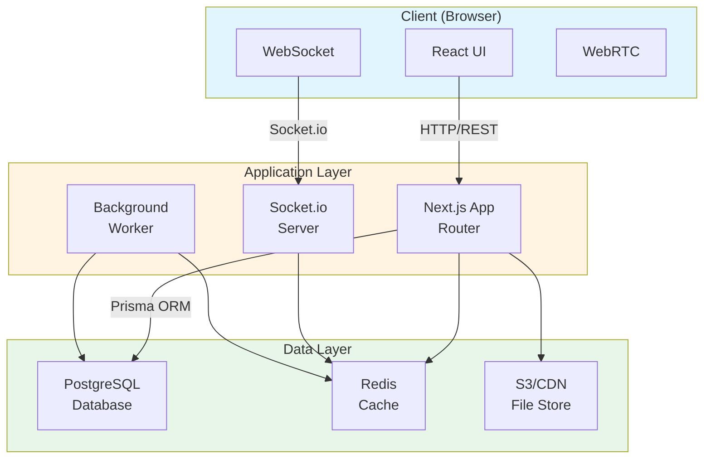
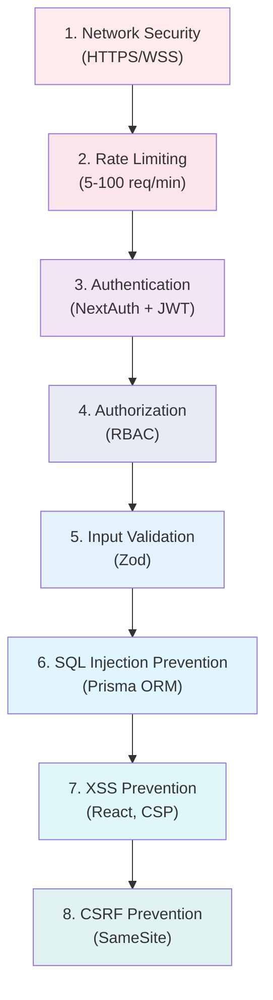
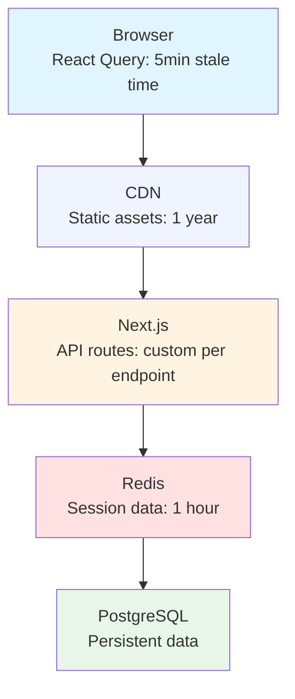

# Architecture Documentation

This document describes the high-level architecture of Synapse and the design decisions behind it.

## Table of Contents

1. [System Overview](#system-overview)
2. [Technology Stack](#technology-stack)
3. [Architecture Patterns](#architecture-patterns)
4. [Component Architecture](#component-architecture)
5. [Data Flow](#data-flow)
6. [Security Architecture](#security-architecture)
7. [Performance Architecture](#performance-architecture)
8. [Design Decisions](#design-decisions)

---

## System Overview

Synapse is a modern real-time chat application built with Next.js 16 and React 19, featuring:

- **Real-time messaging** via WebSocket (Socket.io)
- **Video/audio calls** using WebRTC
- **File sharing** with cloud storage integration
- **Admin dashboard** with analytics and monitoring
- **Performance monitoring** with Sentry integration

### High-Level Architecture



**Note:** WebRTC connections are peer-to-peer (P2P) and use STUN/TURN servers for NAT traversal. Media flows directly between clients, not through our servers.

---

## Technology Stack

### Frontend

| Technology | Purpose | Why We Chose It |
|-----------|---------|-----------------|
| **Next.js 16** | React Framework | SSR, App Router, excellent DX |
| **React 19** | UI Library | Latest features, Server Components |
| **TypeScript** | Type Safety | Catch errors at compile time |
| **Tailwind CSS** | Styling | Utility-first, highly customizable |
| **shadcn/ui** | Component Library | Accessible, customizable components |
| **Zustand** | State Management | Simple, performant, TypeScript-friendly |
| **React Query** | Server State | Caching, synchronization, devtools |
| **Socket.io Client** | WebSocket | Real-time bidirectional communication |
| **Simple-Peer** | WebRTC | Simple WebRTC implementation |

### Backend

| Technology | Purpose | Why We Chose It |
|-----------|---------|-----------------|
| **Next.js API Routes** | REST API | Serverless-ready, TypeScript support |
| **Socket.io** | WebSocket Server | Reliable real-time communication |
| **Prisma** | ORM | Type-safe database access |
| **PostgreSQL** | Database | Reliable, ACID-compliant, relational |
| **Redis** | Cache/Queue | Fast, persistent, pub/sub support |
| **NextAuth** | Authentication | Secure, flexible, provider support |
| **Zod** | Validation | Type-safe schema validation |
| **BullMQ** | Job Queue | Reliable background job processing |

### DevOps & Monitoring

| Technology | Purpose |
|-----------|---------|
| **Sentry** | Error tracking & performance monitoring |
| **Docker** | Containerization |
| **Vercel** | Deployment (frontend) |
| **Railway/Heroku** | Deployment (backend services) |
| **GitHub Actions** | CI/CD |

---

## Architecture Patterns

### 1. Feature-Based Architecture

We organize code by feature rather than by type:

```
features/
└── video-call/
    ├── components/     # Video call UI components
    ├── hooks/          # Video call hooks
    ├── services/       # Video call business logic
    ├── types.ts        # Video call types
    └── index.ts        # Public API
```

**Benefits:**
- High cohesion, low coupling
- Easy to understand and navigate
- Simple to test in isolation
- Can be extracted as a separate package

### 2. Dependency Injection

We use a custom DI container for service management:

```typescript
// lib/di.ts
export class DIContainer {
  private services = new Map();
  
  register<T>(name: string, factory: () => T) {
    this.services.set(name, factory);
  }
  
  async getService<T>(name: string): Promise<T> {
    const factory = this.services.get(name);
    return factory();
  }
}
```

**Benefits:**
- Testable (easy to mock services)
- Flexible (swap implementations)
- Clear dependencies

### 3. Repository Pattern

Data access is abstracted through repositories:

```typescript
// lib/services/message.service.ts
export class MessageService {
  constructor(private db: PrismaClient) {}
  
  async createMessage(data: CreateMessageDto): Promise<Message> {
    return this.db.message.create({ data });
  }
  
  async getMessages(roomId: string): Promise<Message[]> {
    return this.db.message.findMany({ where: { roomId } });
  }
}
```

**Benefits:**
- Separation of concerns
- Easy to test (mock repository)
- Can change data source without affecting business logic

### 4. Middleware Pipeline

Request processing uses a middleware pipeline:

```
Request
  → Authentication
  → Rate Limiting
  → Validation
  → Business Logic
  → Response
```

### 5. Event-Driven Architecture

Real-time features use event-driven patterns:

```typescript
// Emit event
socket.emit('message:new', message);

// Listen for event
socket.on('message:new', (message) => {
  updateUI(message);
});
```

---

## Component Architecture

### Frontend Component Hierarchy

```
App
├── Providers (Auth, Theme, Socket)
│   └── Layout
│       ├── Navigation
│       └── Content
│           ├── Chat Interface
│           │   ├── Room List
│           │   ├── Message List
│           │   └── Message Input
│           └── Video Call (separate tab/window)
│               ├── Participant Grid
│               ├── Controls
│               └── Settings
```

### Component Types

1. **Server Components** (default)
   - Static content
   - Data fetching
   - SEO-important pages

2. **Client Components** (`"use client"`)
   - Interactive UI
   - State management
   - Real-time updates

3. **Hybrid Pages**
   - Server Component layout
   - Client Component islands for interactivity

---

## Data Flow

### 1. Message Flow

```
User Input
  → Client Validation (Zod)
  → Optimistic Update (React Query)
  → API Request (POST /api/messages)
  → Server Validation (Zod)
  → Rate Limit Check
  → Database Insert (Prisma)
  → WebSocket Broadcast (Socket.io)
  → All Clients Update UI
```

### 2. Authentication Flow

```
Login Form
  → NextAuth Credentials Provider
  → Database Lookup (Prisma)
  → Password Verification (bcrypt)
  → JWT Token Generation
  → Session Cookie (httpOnly, secure)
  → Redirect to Dashboard
```

### 3. Video Call Flow

```
Initiate Call
  → Socket.io: call-initiate event
  → Server: Notify participants
  → Client: Show incoming call dialog
  → Accept Call
  → WebRTC: Create peer connection
  → Exchange ICE candidates (Socket.io)
  → Establish connection
  → Start media streams
```

---

## Security Architecture

### Defense in Depth

We implement multiple layers of security:



### Security Headers

```javascript
// next.config.js
{
  'Strict-Transport-Security': 'max-age=63072000',
  'X-Frame-Options': 'SAMEORIGIN',
  'X-Content-Type-Options': 'nosniff',
  'Content-Security-Policy': '...',
  'Permissions-Policy': 'camera=(self), microphone=(self)',
}
```

### Input Validation

All inputs validated with Zod at both client and server:

```typescript
const messageSchema = z.object({
  content: z.string().max(2000),
  roomId: z.string(),
});
```

---

## Performance Architecture

### 1. Code Splitting

- **Route-based:** Automatic with Next.js App Router
- **Component-based:** Dynamic imports for heavy components
- **Vendor splitting:** Separate chunks for libraries

### 2. Caching Strategy



### 3. Database Optimization

- **Indexes:** On frequently queried columns
- **Connection pooling:** Prisma connection pool
- **Query optimization:** Select only needed fields
- **Pagination:** Limit result sets

### 4. Real-time Optimization

- **WebSocket connection pooling**
- **Message batching** (optional)
- **Selective room subscriptions**
- **Compression** for large payloads

---

## Design Decisions

### Why Next.js 16?

**Pros:**
- App Router with Server Components
- Built-in API routes
- Great DX and TypeScript support
- Vercel deployment optimization

**Cons:**
- Learning curve for new patterns
- Some features still stabilizing

**Decision:** Benefits outweigh learning curve. Staying on cutting edge gives us competitive advantage.

### Why Socket.io over native WebSockets?

**Pros:**
- Automatic reconnection
- Room management built-in
- Fallback transports
- Large ecosystem

**Cons:**
- Larger bundle size
- More opinionated

**Decision:** Reliability and features worth the trade-off. Simple-peer handles WebRTC complexity.

### Why Prisma over raw SQL?

**Pros:**
- Type safety
- Migration management
- Excellent TypeScript support
- Query builder prevents SQL injection

**Cons:**
- Slight performance overhead
- Learning curve

**Decision:** Type safety and developer experience critical for team productivity.

### Why Feature-based structure?

**Pros:**
- High cohesion
- Easy to find related code
- Can extract features as packages
- Better for large teams

**Cons:**
- Non-standard (most use type-based)
- May duplicate some utilities

**Decision:** Scales better as app grows. Easier for new developers to understand.

### Why Separate Socket.io Server?

**Pros:**
- Independent scaling
- Better resource management
- No Next.js build overhead
- Can be deployed separately

**Cons:**
- More deployment complexity
- Additional server to manage

**Decision:** Performance and scaling requirements justify separate service.

---

## Future Architecture Considerations

### Microservices

Consider splitting into microservices when:
- Team size > 20 developers
- Need independent scaling per feature
- Different deployment schedules needed

**Potential services:**
- Auth Service
- Message Service  
- Call Service
- File Service
- Notification Service

### Message Queue

Consider adding message queue when:
- Need guaranteed delivery
- Want to decouple services
- Async processing required

**Options:**
- RabbitMQ
- Apache Kafka
- AWS SQS

### CDN for WebSocket

Consider CDN with WebSocket support when:
- Global user base
- Latency critical
- High connection count

**Options:**
- Cloudflare Workers
- AWS CloudFront
- Fastly

---

## References

- [Next.js Documentation](https://nextjs.org/docs)
- [React Documentation](https://react.dev)
- [Socket.io Documentation](https://socket.io/docs)
- [Prisma Documentation](https://www.prisma.io/docs)
- [WebRTC Specification](https://webrtc.org)

---

For questions about architecture, please open a discussion on GitHub.

